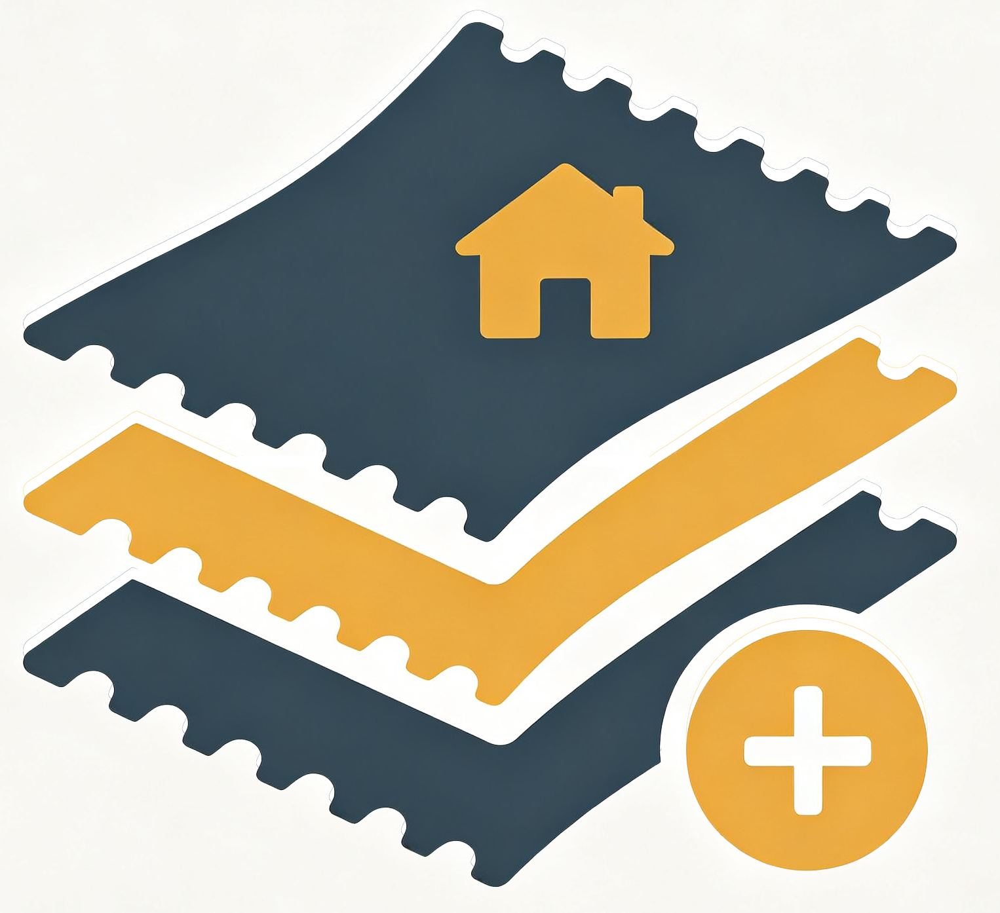
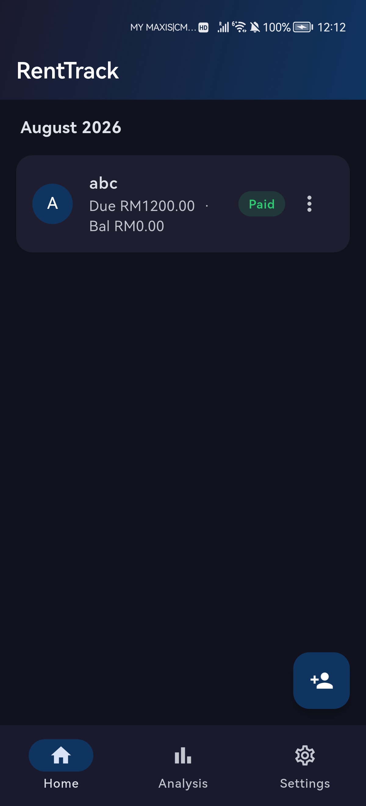
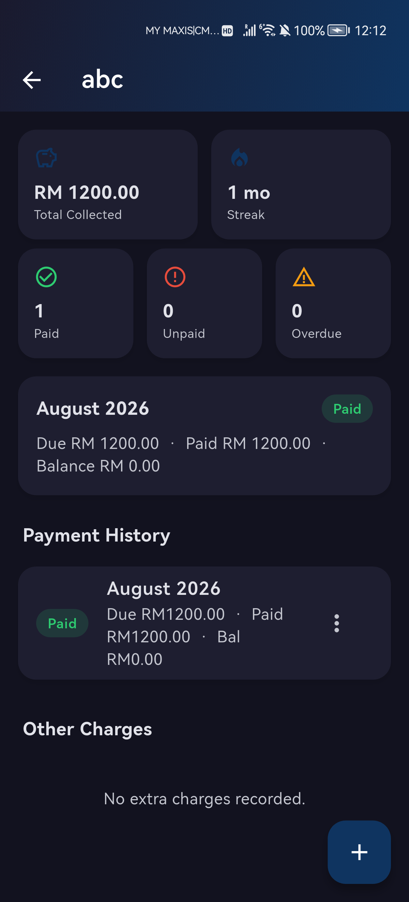
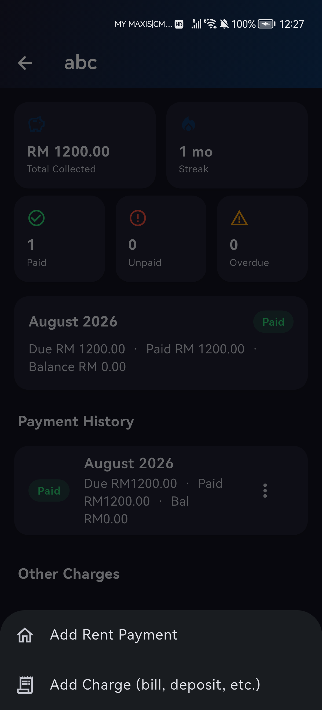
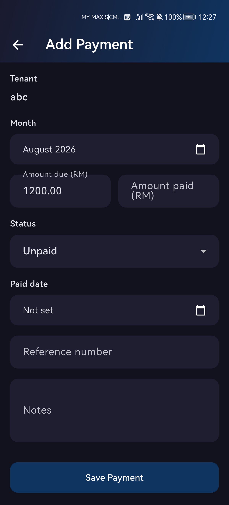
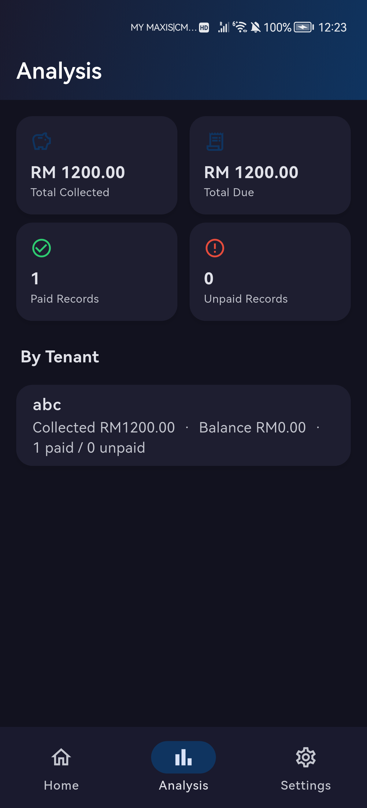
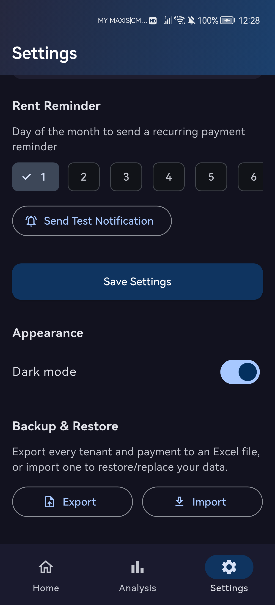

# RentTrack

A multi-tenant rent payment tracker built with Flutter. Manage tenants, record monthly rent payments and one-off charges, generate PDF invoices, and back up everything to Excel — all stored locally on your device.

<p align="center">
  
</p>

## Screenshots

| Home | Tenant Dashboard | Invoice |
|---|---|---|
|  |  |  |

| Add Payment | Analysis | Settings (Dark Mode) |
|---|---|---|
|  |  |  |

## Features

- **Multi-tenant management** — add, edit, and remove tenants, each with their own independent payment history.
- **Home dashboard** — see every tenant's current-month payment status (Paid / Partial / Unpaid) at a glance.
- **Per-tenant dashboard** — total collected, payment streak, overdue count, and full reverse-chronological payment history with swipe-to-delete.
- **Rent payments & extra charges** — record monthly rent alongside one-off charges (utility bills, deposits, maintenance) without mixing them into rent stats.
- **PDF invoices** — generate a polished, branded invoice per payment and share it directly from the device.
- **Analysis tab** — cross-tenant totals and a per-tenant collected/balance breakdown.
- **Excel backup & restore** — export all tenants, payments, and charges to a single `.xlsx` file, and import one to restore.
- **Dark / light mode** — toggle from Settings, persisted across launches.
- **Configurable currency symbol** — not hardcoded; set it once in Settings.
- **Recurring rent reminder** — a monthly local notification on a day you choose.
- **No external backend required** — all data lives on-device via `shared_preferences`; nothing to deploy or configure.

## Tech Stack

- [Flutter](https://flutter.dev) (Material 3), Android-first
- Local storage: `shared_preferences`
- PDF generation: `pdf` + `printing`
- Sharing: `share_plus`
- Excel import/export: `excel` + `file_picker`
- Notifications: `flutter_local_notifications` + `timezone`

## Getting Started

### Prerequisites

- [Flutter SDK](https://docs.flutter.dev/get-started/install) (stable channel)
- Android Studio / Xcode for platform tooling, or a connected device/emulator

### Setup

```bash
git clone https://github.com/nexiontechmy/RentTrack.git
cd RentTrack
flutter pub get
```

### Run

```bash
flutter run
```

### Build a release APK

```bash
flutter build apk --release
```

The signed APK will be at `build/app/outputs/flutter-apk/app-release.apk`.

## Project Structure

```
lib/
├── models/       # Tenant, Payment, Charge, RentSettings data classes
├── services/     # Local repositories, PDF generation, Excel import/export
├── screens/      # Home, Analysis, Settings tabs + tenant/payment/charge forms
├── theme/        # App theming and dark/light mode controller
├── utils/        # Shared helpers (month parsing/formatting)
└── widgets/      # Reusable UI components
```

## Data & Privacy

All tenant and payment data is stored locally on your device — nothing is sent to any server. Use the **Export** button in Settings to create an `.xlsx` backup, and **Import** to restore from one (note: import replaces all current data with the file's contents).
